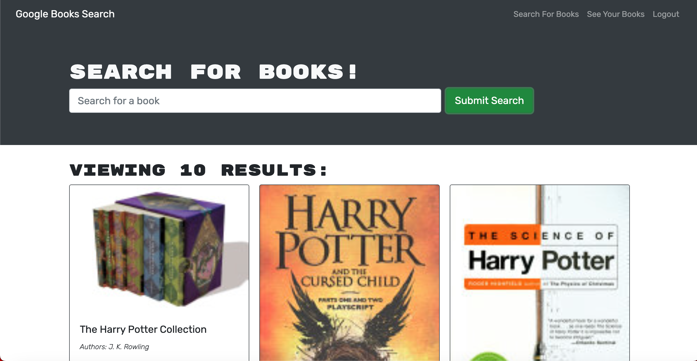

# Book-Lookup-Application-MERN

## Description

- A MERN application that allows a user to look up any book title using the Google Book API, and gives them the option to save them to their own list!

## Usage

- Run npm install to install all dependencies.

- Run npm start to start up the server.

- Navigate to localhost:3001 to view the site.

- Login or sign up.

- Search any book title.

- Browse the selection, and save the desired book to your list!

- If needed, remove the book from your list.

- Or, navigate to the deployed link below!

## Deployed Link

- 

## Authors

- https://github.com/Lmickk2